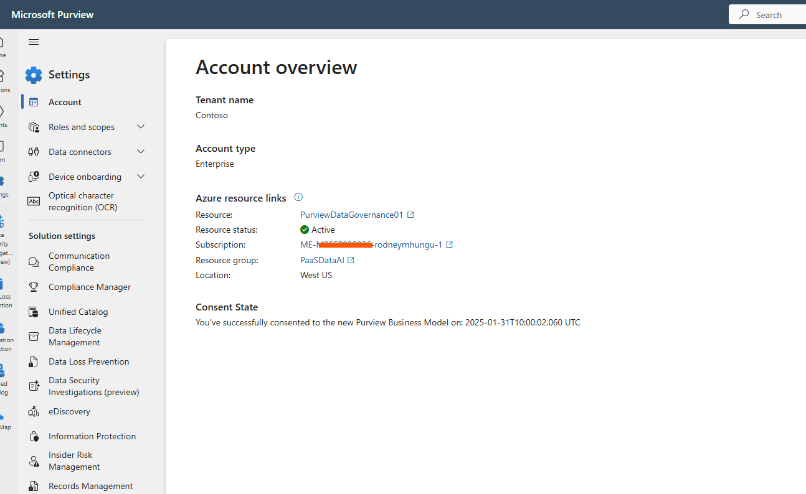

# Prerequisites 

To test the integration of Microsoft Purview with Fabric and Azure for data classification and protection, follow this checklist to ensure you have the right setup.

## Core Setup Requirements

1. **Microsoft Entra ID Tenant (formerly Azure AD)**
   - You need access to a **Microsoft Entra ID tenant**, which acts as your organization’s identity and access management platform.
   - If you're part of a Microsoft partner or enterprise environment, your organization may already provide a demonstration or test tenant.
   - Otherwise, you can request an on-demand tenant depending on your role and business justification for testing Microsoft data governance services (e.g., via Microsoft Partner Center, Visual Studio subscription, or internal IT process).
   - 📘 [What is Microsoft Entra ID?](https://learn.microsoft.com/en-us/entra/fundamentals/whatis)

2. **Microsoft Azure Subscription**
   - You need an active **Azure subscription** (e.g., Pay-as-you-go, Visual Studio, or organizational).
   - This is required to create and manage resources like Azure Storage, Azure SQL, and Microsoft Purview accounts.
   - 📘 [Create an Azure subscription](https://learn.microsoft.com/en-us/azure/cost-management-billing/manage/create-subscription)

3. **Microsoft 365 E5 License**
   - You need a the E5 license, which includes [Microsoft 365 bundle of apps and products](https://m365maps.com) and the following advanced data security products:
     - Microsoft Purview Information Protection
     - Microsoft Purview Data Loss Prevention
   - At minimum, ensure one user has a valid **Microsoft 365 E5** or **Microsoft 365 E5 Compliance** license.
   - 📘 [Compare Microsoft 365 E5 licensing options](https://www.microsoft.com/microsoft-365/compare-microsoft-365-enterprise-plans)
   - 📘 [Start a Microsoft Fabric trial](https://learn.microsoft.com/en-us/fabric/get-started/fabric-trial)

4. **Microsoft Fabric Trial or Capacity**
   - You need access to Microsoft Fabric features within the Power BI portal.
   - If you don't have Fabric enabled yet, go to [Fabric in Power BI](https://app.fabric.microsoft.com/) and start a trial.
   - 📘 [Enable Microsoft Fabric for your organization](https://learn.microsoft.com/en-us/fabric/get-started/enable-fabric)
   - Ensure your user can create and access the following Fabric items:
     - [OneLake](https://learn.microsoft.com/en-us/fabric/onelake/overview) – the unified SaaS data lake for all your Fabric items
     - [Lakehouses](https://learn.microsoft.com/en-us/fabric/data-engineering/lakehouse-overview) – for combining structured and unstructured data
     - [Notebooks](https://learn.microsoft.com/en-us/fabric/data-science/notebooks-overview) – for code-first data science and exploration
     - [Semantic Models](https://learn.microsoft.com/en-us/fabric/data-models/semantic-models-overview) – for building reusable, governed data models

---

## Role & Permission Checklist

| Product Area           | Role/Permission Needed                                                                 | Description |
|------------------------|----------------------------------------------------------------------------------------|-------------|
| **Microsoft Purview**  | **Purview Administrator** or **Data Curator**                                         | Manage scans, classification, and Data Map configurations. 📘 [Purview data governance roles & permissions](https://learn.microsoft.com/en-us/purview/data-governance-roles-permissions) |
|                        | **Sensitivity Label Administrator** (via role group or direct assignment)             | Create and publish sensitivity labels and policies. 📘 [Get started with sensitivity labels](https://learn.microsoft.com/en-us/purview/get-started-with-sensitivity-labels) |
|                        | Role Groups: **Information Protection**, **Information Protection Admins**, **Compliance Administrator**, **Compliance Data Administrator**, **Security Administrator**, **Organization Management** | Required to fully manage or review sensitivity labels. 📘 [Roles and role groups in Defender & Purview](https://learn.microsoft.com/en-us/defender-office-365/scc-permissions) |
|                        | **Azure RBAC**: **Owner** or **Contributor** on the Purview resource group            | Required to create or edit scans, sensitivity labels, and policies. 📘 [Azure built-in roles: Owner, Contributor](https://learn.microsoft.com/en-us/azure/role-based-access-control/built-in-roles) |
| **Azure Storage / SQL**| **Storage Blob Data Reader** (or Contributor) + **Reader** on storage account         | Required to scan and classify Blob or SQL data assets. 📘 [Assign role for Blob data access](https://learn.microsoft.com/en-us/azure/storage/blobs/assign-azure-role-data-access) |
|                        | **Owner** on Azure resource group (recommended for POC/testing)                      | Grants full permissions to manage resource configuration and scanning. 📘 [Azure built-in roles: Owner](https://learn.microsoft.com/en-us/azure/role-based-access-control/built-in-roles) |
| **Microsoft Fabric**   | Access to **Fabric Trial** or capacity-enabled workspace                              | Needed to use Fabric features such as OneLake, Lakehouses, and Notebooks. 📘 [Enable Microsoft Fabric](https://learn.microsoft.com/en-us/fabric/get-started/enable-fabric) |
|                        | **Workspace Role**: **Admin**, **Member**, **Contributor**, or **Viewer**             | Allows creating, editing, or consuming Fabric assets. 📘 [Workspace roles in Fabric](https://learn.microsoft.com/en-us/power-bi/collaborate-share/service-roles-new-workspaces) |
|                        | Member of the Fabric workspace                                                       | Ensures permission to build and modify workspace content. |

---

## Other Setup Steps

- **Access the Microsoft Purview Portal**  
  [Go to Microsoft Purview Portal](https://purview.microsoft.com)  
  This is the modern portal for Microsoft Purview governance and security.  
  Do not use [https://web.purview.azure.com](https://web.purview.azure.com) — this is the legacy portal and no longer recommended.

- **Verify Enterprise Version of Microsoft Purview**  
  Check your account type at: [https://purview.microsoft.com/settings/account](https://purview.microsoft.com/settings/account)  
  Learn how to upgrade to Enterprise: [Microsoft Learn Guide](https://learn.microsoft.com/en-us/purview/data-governance-free-version-upgrade-to-enterprise)  
  Make sure your account is using the Enterprise version to access multicloud classification, scanning, and sensitivity labeling features.

  

- **Enable Microsoft Purview Information Protection**  
  Go to [Microsoft Purview Compliance Portal](https://compliance.microsoft.com/)  
  Create or confirm sensitivity labels are active.

- **Set up sensitivity label publishing**  
  Assign a label policy to the user from the Microsoft 365 Compliance Center so they can apply labels in Microsoft Fabric or Office.

- **Configure Scan in Microsoft Purview (Governance)**  
  Scan your Azure SQL or Blob Storage using the Purview Data Map and Classification Engine.

- **Connect Fabric to a labeled Azure data source**  
  In Fabric, create a Lakehouse or semantic model using a source that was labeled by Purview. Check whether labels flow through.

- **Ensure Audit Premium is turned on**  
  For most production environments using Microsoft 365 (Office) products, this already turned on. If you're using a demo or test tenant, it might not be. Instructions here: [Turn Microsoft Purview auditing on or off](https://learn.microsoft.com/en-us/purview/audit-log-enable-disable)

---

## ⚠️ Common Pitfalls

- **Missing E5 License:** Without it, auto-labeling and protection will not work in Microsoft 365, Purview, or Fabric.
- **Label Not Published to User:** Even if labels are created, users can't apply or inherit them unless a label policy is assigned to them.
- **No Fabric Capacity Assigned:** Even with a license, you may need to explicitly enable Fabric or request access to a workspace with capacity.
- **Lack of Azure RBAC:** Without correct role assignments in Azure (e.g., Contributor on the resource group), Purview will fail to scan or label data assets in Azure.
- **TLDR:** The formal Microsoft technical prerequisites docs are a long read, but if you're up for it, they help a lot!  - [Official deployment checklist for the Microsoft Purview Data Governance Solutions](https://learn.microsoft.com/en-us/purview/legacy/tutorial-azure-purview-checklist?source=recommendations)

---
