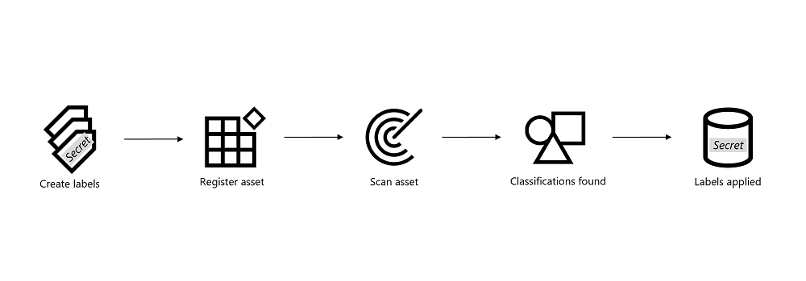

## 🏷️ How Sensitivity Labels Are Applied to Assets in Data Map (5-Step Walkthrough)

Before we dive into the hands-on setup, here’s a simplified visual of how sensitivity labeling works with Microsoft Purview Data Map:

Reference: [How to apply labels to assets in the Microsoft Purview Data Map](https://learn.microsoft.com/en-us/purview/data-map-sensitivity-labels#how-to-apply-labels-to-assets-in-the-microsoft-purview-data-map) 

Each step represents a core action in the process:

<strong>1. Create or Modify a Label</strong>

If you already have an existing sensitivity label taxonomy, you can jump right into modifying one. Otherwise, create a new label from scratch using Microsoft Purview’s built-in wizard.

Examples:
- “Confidential – Employees Only”
- “Highly Confidential – Financial”

For labels to work across Azure and Microsoft 365, make sure they are:
- Published via a **Label Policy**

---

### (a) Go to the Sensitivity Labels menu

Open the Microsoft Purview portal → scroll to the **Data Security** section → click on **Information Protection**.

📸 Screenshot: Microsoft Purview homepage → Information Protection section  

📸 Screenshot: Data Security section with Information Protection card  

If you don’t see the card, click **View all solutions**.  
If the menu is completely missing, you may not have the right permissions. [Check Microsoft Docs](https://learn.microsoft.com/en-us/microsoft-365/compliance/sensitivity-labels#permissions)

---

### (b) Create or Edit a Sensitivity Label

- To **create** a new label → click **+ Create a label**
- To **edit** an existing one → click the **...** next to the label name and choose **Edit**

📸 Screenshot: "Create label" wizard entry point  

📸 Screenshot: Context menu with edit option  

---

### (c) Define Basic Label Details

Enter:

- **Name** (internal)
- **Display name** (user-facing)
- **Description for users**
- (Optional) Color, priority, or admin notes

📸 Screenshot: Basic label metadata form  

---

### (d) Set the Scope

Enable **Files & other data assets** to ensure this label applies to Azure and Microsoft Fabric.

📸 Screenshot: Scope selection interface  

---

### (e) Configure File-Level Access Controls

Control who can open files with this label. Options include:

- Encryption
- User/group-based permissions
- Expiration dates
- Offline access controls

📸 Screenshot: Access control settings  

📸 Screenshot: Assigning permissions  

---

### (f) Configure Protection for Groups & Sites (Optional)

If you selected **Groups & sites** in your scope, set:

- Privacy: Public or private
- Sharing: Internal vs external user access
- Meeting/Team settings

📸 Screenshot: Groups & Sites settings  

📸 Screenshot: External user access controls  

---

### (g) External Sharing & Conditional Access (Optional)

Use **Microsoft Entra Conditional Access** to control external or unmanaged device access to SharePoint or Teams sites labeled with this label.

📸 Screenshot: Conditional Access configuration  

---

### (h) Review and Save

Summarize all settings before clicking **Save label**.

📸 Screenshot: Final label review screen  

---

### 🧠 Quick Tip: Label Priority Matters

If more than one label can apply to an item, the highest-priority label will be enforced.  
Return to the Sensitivity Labels overview and click **Reorder** to adjust priorities.

🔗 [Learn more: Create and publish sensitivity labels](https://learn.microsoft.com/en-us/microsoft-365/compliance/sensitivity-labels)

<strong>2. Register Asset</strong>

Connect your data asset to Microsoft Purview Data Map.

This step involves:
- Registering the **data source** (e.g. the storage account)
- Adding a **scan rule set** to define what Purview should look for

🔗 [Register and scan Azure Blob Storage](https://learn.microsoft.com/en-us/purview/register-blob-storage)

<strong>3. Scan Asset</strong>

Trigger a **scan** on the registered asset. Purview will inspect the contents of your `.docx` files in Blob Storage.

The scan uses:
- **Built-in** or **custom classification rules**
- Regex patterns and keyword dictionaries

You can schedule recurring scans or run them ad hoc.

🔗 [Configure and run scans](https://learn.microsoft.com/en-us/purview/create-scan)

<strong>4. Classifications Found</strong>

After scanning, Purview identifies **sensitive data types** such as:

- BSNs (Dutch Social Security Numbers)
- IBANs (Bank Account Numbers)
- Passport Numbers

These are visible in the **classification results** tab for each asset.

🔗 [Supported classification types](https://learn.microsoft.com/en-us/purview/data-map-classification-supported-list)

<strong>4.5 Create Auto-Labeling Policy</strong>

To ensure that labels are **automatically applied** based on classification results, you must configure an **auto-labeling policy** for your non-Microsoft 365 assets like Azure Blob Storage or Azure SQL.

This step bridges your classification findings with actionable protection.

#### Steps:

1. Open the **Microsoft Purview portal** and go to:  
   `Data Security → Information Protection → Auto-labeling`
2. Select **+ Create auto-labeling policy**
3. Choose **non-Microsoft 365 locations**
4. Define your **scope**:  
   - Apply to **all assets**, or  
   - Select specific containers or storage accounts
5. Choose the **sensitivity label** to apply  
   _(It must be scoped to "Files & other data assets")_
6. Add **classification conditions** to trigger the label  
   _(e.g., IBAN, BSN, passport number)_
7. Review and **publish the policy**

📘 [How to create auto-labeling policy](https://learn.microsoft.com/en-us/purview/data-map-sensitivity-labels-apply#step-3-create-an-auto-labeling-policy)

🧠 **Note:** Labeling will occur during the **next scan** of assets that match this policy.

<strong>5. Labels Applied</strong>

Once your **auto-labeling policy** is in place and you re-scan your assets:

- A sensitivity label is applied **as metadata** to the asset (file, blob, or container)
- The label is visible inside the Microsoft Purview portal
- It is also **enforced** and **respected** in downstream tools like **Microsoft Fabric**

This gives you:

- ✅ Consistent classification-to-label enforcement
- 🧾 An audit trail for sensitive data
- 🧩 Integration into analytics, compliance, and access control workflows

📘 [Apply labels in Data Map](https://learn.microsoft.com/en-us/purview/data-map-sensitivity-labels-apply)

