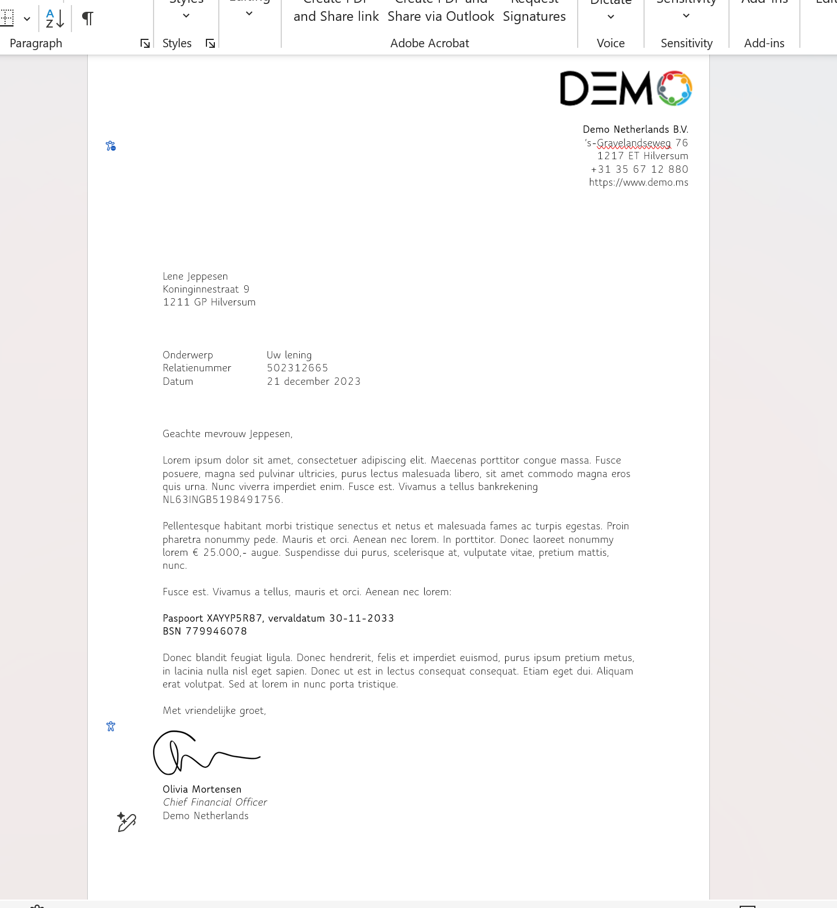
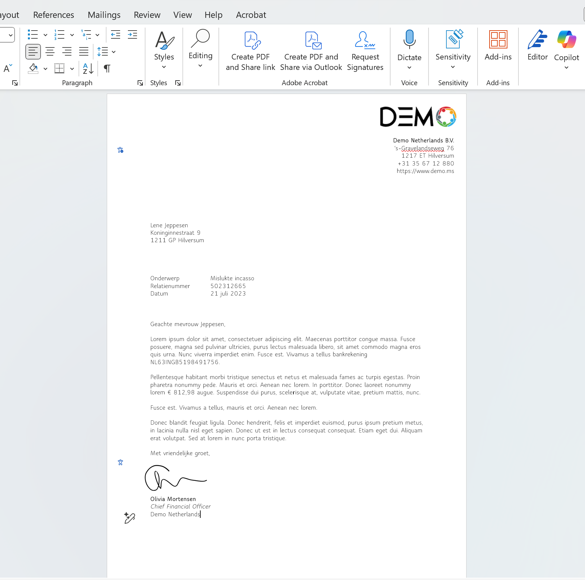
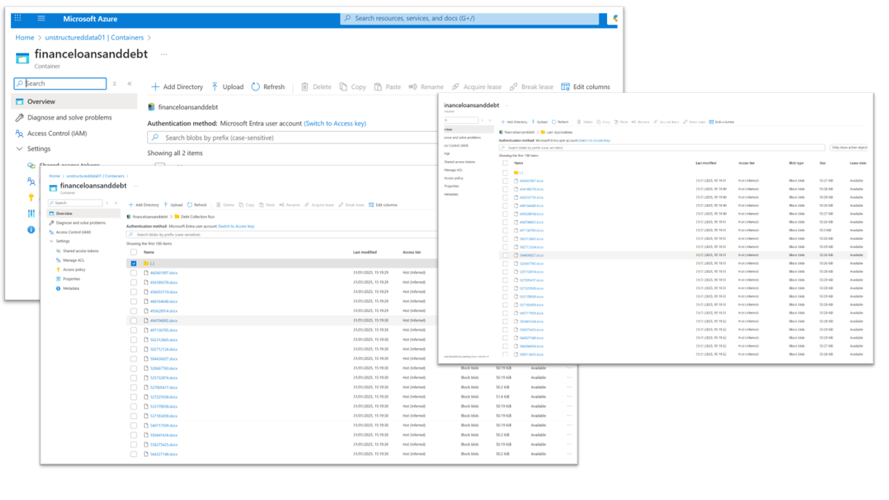

# Testing Scenario: Bank Letters Stored in Blob Storage

<strong>📘 Use Case Overview</strong>

In this demonstration, we're simulating a scenario at a fictional bank that processes two types of customer letters weekly:

- **Loan Approval Letters** – confirming amounts granted
- **Debt Collection Letters** – follow-ups on missed payments

For audit and recordkeeping purposes, these letters are stored as `.docx` files in **Azure Blob Storage**, using filenames like:

- `Loan_Confirmation_502312665.docx`  
- `Debt_Collection_456055719.docx`

100s/1000s/millions of the files stored together amount to [**unstructured data**](https://en.wikipedia.org/wiki/Unstructured_data) in Azure, making them ideal candidates for classification using **Microsoft Purview Data Map**. 

<strong>📎 Download the Sample Files</strong>

You can download the sample files used in this scenario:

**[⬇ Download dummy_data_azure_blob_storage.zip](https://github.com/rodneymhungu/purview-protect-azure-fabric/blob/main/purview-protect-azure-fabric/dummy-files/dummy_data_azure_blob_storage.zip)**  
_This ZIP contains the `.docx` files used in this Blob Storage classification simulation._

<strong>🖼️ Example Letter Screenshots</strong>

These are the sample documents:

- **Loan Confirmation Letter**  
  

- **Debt Collection Letter**  
  

<strong>📂 Example Storage Layout</strong>

The files are uploaded into an [Azure Blob Storage](https://learn.microsoft.com/en-us/azure/storage/blobs/storage-blobs-introduction) container. Example view:

<strong>🔍 What’s Inside These Files</strong>

Each `.docx` file contains a mix of business and sensitive data:

| **Data Type**            | **Example**                                        |
|--------------------------|----------------------------------------------------|
| Recipient Information    | Full name, home address                            |
| Account Identifiers      | IBANs, relationship or reference numbers           |
| Sensitive Identifiers    | BSN (Dutch Social Security Number), passport number |
| Financial Data           | Loan amount, debt owed                             |
| Letter Type Metadata     | Letter date, document layout, letter type          |

<strong>🎯 Why This Data Matters</strong>

From an analytics standpoint, this data offers value:

- Correlating **loan sizes** to **postal codes**
- Tracking **collection rates** over time
- Understanding customer behavior through text patterns

However, it also contains **regulated** and **personal** data:

- IBANs and BSNs must be handled per GDPR and internal policies
- Analysts typically require **aggregated** results, not identifiers
- Unprotected access risks **data leakage**

This balance between usability and privacy makes it a prime candidate for classification and sensitivity labeling.

<strong>🔐 Why Use Purview for Blob Classification</strong>

With **Microsoft Purview**, you can:

- **Classify files in Blob Storage** by scanning for patterns like:
  - IBANs
  - BSNs
  - Passport numbers
- Automatically **apply sensitivity labels** like:
  - “Confidential – Employees Only”
  - “Highly Confidential – Financial”
- Feed this metadata into:
  - **Microsoft Fabric** for secure analytics
  - **Microsoft 365** for labeling consistency when analytics is used in workplace tools like Excel and Powerpoint to communicate to broader audiences

This ensures:
- Consistent policy enforcement
- Audit readiness
- Access control and protection across services

# _Under construction 20-08-2025_ - labelling and protecting data in blob storage test reproduction
---

