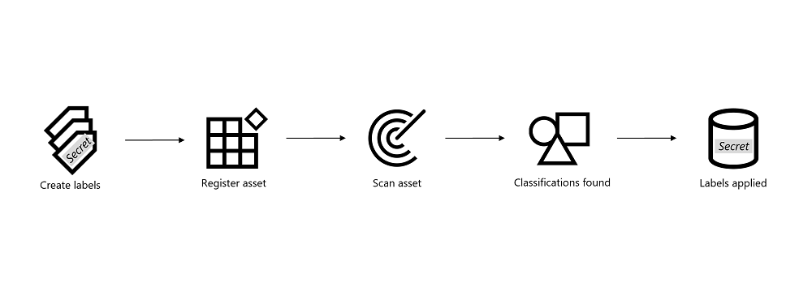

# Testing Scenario: Bank Letters Stored in Blob Storage

<strong>📘 Use Case Overview</strong>

In this demonstration, we're simulating a scenario at a fictional bank that processes two types of customer letters weekly:

- **Loan Approval Letters** – confirming amounts granted
- **Debt Collection Letters** – follow-ups on missed payments

For audit and recordkeeping purposes, these letters are stored as `.docx` files in **Azure Blob Storage**, using filenames like:

- `Loan_Confirmation_502312665.docx`  
- `Debt_Collection_456055719.docx`

100s/1000s/millions of the files stored together amount to [**unstructured data**](https://en.wikipedia.org/wiki/Unstructured_data) in Azure, making them ideal candidates for classification using **Microsoft Purview Data Map**. 

<strong>📠Download the Sample Files</strong>

You can download the sample files used in this scenario:

**[⬇ Download dummy_data_azure_blob_storage.zip](https://github.com/rodneymhungu/purview-protect-azure-fabric/blob/main/purview-protect-azure-fabric/dummy-files/dummy_data_azure_blob_storage.zip)**  
_This ZIP contains the `.docx` files used in this Blob Storage classification simulation._

<strong>🖼️ Example Letter Screenshots</strong>

These are the sample documents:

- **Loan Confirmation Letter**  
  

- **Debt Collection Letter**  
  

<strong>📂 Example Storage Layout</strong>

The files are uploaded into an [Azure Blob Storage](https://learn.microsoft.com/en-us/azure/storage/blobs/storage-blobs-introduction) container. Example view:

<strong>🔠What’s Inside These Files</strong>

Each `.docx` file contains a mix of business and sensitive data:

| **Data Type**            | **Example**                                        |
|--------------------------|----------------------------------------------------|
| Recipient Information    | Full name, home address                            |
| Account Identifiers      | IBANs, relationship or reference numbers           |
| Sensitive Identifiers    | BSN (Dutch Social Security Number), passport number |
| Financial Data           | Loan amount, debt owed                             |
| Letter Type Metadata     | Letter date, document layout, letter type          |

<strong>🯠Why This Data Matters</strong>

From an analytics standpoint, this data offers value:

- Correlating **loan sizes** to **postal codes**
- Tracking **collection rates** over time
- Understanding customer behavior through text patterns

However, it also contains **regulated** and **personal** data:

- IBANs and BSNs must be handled per GDPR and internal policies
- Analysts typically require **aggregated** results, not identifiers
- Unprotected access risks **data leakage**

This balance between usability and privacy makes it a prime candidate for classification and sensitivity labeling.

<strong>🔠Why Use Purview for Blob Classification</strong>

With **Microsoft Purview**, you can:

- **Classify files in Blob Storage** by scanning for patterns like:
  - IBANs
  - BSNs
  - Passport numbers
- Automatically **apply sensitivity labels** like:
  - “Confidential – Employees Only”
  - “Highly Confidential – Financial”
- Feed this metadata into:
  - **Microsoft Fabric** for secure analytics
  - **Microsoft 365** for labeling consistency when analytics is used in workplace tools like Excel and Powerpoint to communicate to broader audiences

This ensures:
- Consistent policy enforcement
- Audit readiness
- Access control and protection across services

---
## 🏷️ How Sensitivity Labels Are Applied to Blob Data (5-Step Walkthrough)

_Under construction 22-07-2025_

Before we dive into the hands-on setup, here’s a simplified visual of how sensitivity labeling works with Microsoft Purview Data Map:

Reference: [How to apply labels to assets in the Microsoft Purview Data Map](https://learn.microsoft.com/en-us/purview/data-map-sensitivity-labels#how-to-apply-labels-to-assets-in-the-microsoft-purview-data-map) 

Each step represents a core action in the process:

<strong>1. Create or Modify a Label</strong>

If you already have an existing sensitivity label taxonomy, you can jump right into modifying one. Otherwise, create a new label from scratch using Microsoft Purview’s built-in wizard.

Examples:
- “Confidential – Employees Only”
- “Highly Confidential – Financial”

For labels to work across Azure and Microsoft 365, make sure they are:
- Published via a **Label Policy**

---

### (a) Go to the Sensitivity Labels menu

Open the Microsoft Purview portal → scroll to the **Data Security** section → click on **Information Protection**.

📸 Screenshot: Microsoft Purview homepage → Information Protection section  

📸 Screenshot: Data Security section with Information Protection card  

If you don’t see the card, click **View all solutions**.  
If the menu is completely missing, you may not have the right permissions. [Check Microsoft Docs](https://learn.microsoft.com/en-us/microsoft-365/compliance/sensitivity-labels#permissions)

---

### (b) Create or Edit a Sensitivity Label

- To **create** a new label → click **+ Create a label**
- To **edit** an existing one → click the **...** next to the label name and choose **Edit**

📸 Screenshot: "Create label" wizard entry point  

📸 Screenshot: Context menu with edit option  

---

### (c) Define Basic Label Details

Enter:

- **Name** (internal)
- **Display name** (user-facing)
- **Description for users**
- (Optional) Color, priority, or admin notes

📸 Screenshot: Basic label metadata form  

---

### (d) Set the Scope

Enable **Files & other data assets** to ensure this label applies to Azure and Microsoft Fabric.

📸 Screenshot: Scope selection interface  

---

### (e) Configure File-Level Access Controls

Control who can open files with this label. Options include:

- Encryption
- User/group-based permissions
- Expiration dates
- Offline access controls

📸 Screenshot: Access control settings  

📸 Screenshot: Assigning permissions  

---

### (f) Configure Protection for Groups & Sites (Optional)

If you selected **Groups & sites** in your scope, set:

- Privacy: Public or private
- Sharing: Internal vs external user access
- Meeting/Team settings

📸 Screenshot: Groups & Sites settings  

📸 Screenshot: External user access controls  

---

### (g) External Sharing & Conditional Access (Optional)

Use **Microsoft Entra Conditional Access** to control external or unmanaged device access to SharePoint or Teams sites labeled with this label.

📸 Screenshot: Conditional Access configuration  

---

### (h) Review and Save

Summarize all settings before clicking **Save label**.

📸 Screenshot: Final label review screen  

---

### 🧠 Quick Tip: Label Priority Matters

If more than one label can apply to an item, the highest-priority label will be enforced.  
Return to the Sensitivity Labels overview and click **Reorder** to adjust priorities.

🔗 [Learn more: Create and publish sensitivity labels](https://learn.microsoft.com/en-us/microsoft-365/compliance/sensitivity-labels)

<strong>2. Register Asset</strong>

Connect your Azure Blob Storage account to Microsoft Purview Data Map.

This step involves:
- Registering the **data source** (e.g. the storage account)
- Adding a **scan rule set** to define what Purview should look for

🔗 [Register and scan Azure Blob Storage](https://learn.microsoft.com/en-us/purview/register-blob-storage)

<strong>3. Scan Asset</strong>

Trigger a **scan** on the registered asset. Purview will inspect the contents of your `.docx` files in Blob Storage.

The scan uses:
- **Built-in** or **custom classification rules**
- Regex patterns and keyword dictionaries

You can schedule recurring scans or run them ad hoc.

🔗 [Configure and run scans](https://learn.microsoft.com/en-us/purview/create-scan)

<strong>4. Classifications Found</strong>

After scanning, Purview identifies **sensitive data types** such as:

- BSNs (Dutch Social Security Numbers)
- IBANs (Bank Account Numbers)
- Passport Numbers

These are visible in the **classification results** tab for each asset.

🔗 [Supported classification types](https://learn.microsoft.com/en-us/purview/data-map-classification-supported-list)

<strong>5. Labels Applied</strong>

Based on the classification results and your auto-labeling policy:

- A sensitivity label is applied **as metadata** to the Blob file or container
- This label can later be visualized in Microsoft Fabric and honored in downstream systems

The result:
- Consistent enforcement
- Audit trail
- Integration into your compliance and analytics workflows

🔗 [Apply labels in Data Map](https://learn.microsoft.com/en-us/purview/data-map-sensitivity-labels-apply)

